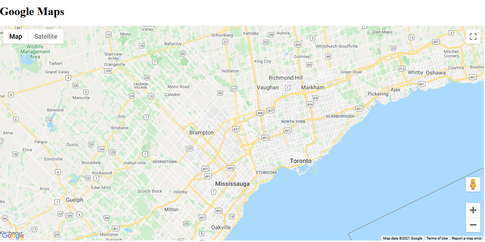
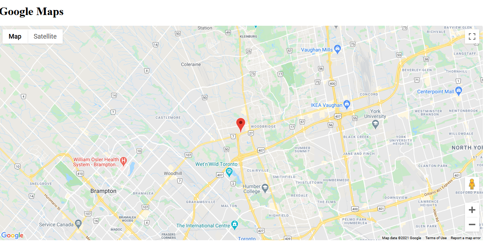

## This is a simple HTML page which displays a google Map . The map works in the following mannner

- Display a world map
- Adds a marker at the location clicked by the user . 
- The Map centers on the clicked location and zooms in.

### Some of the HTML Interfaces are provided below :

  
  
